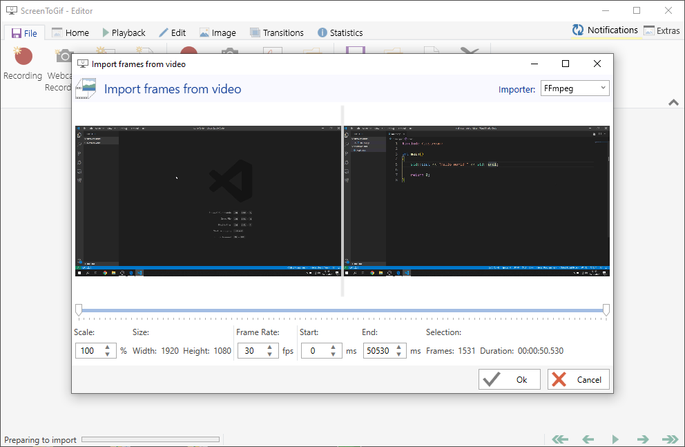

# How to save screen capture as good quality GIF on Windows

It's quite common for Visual Studio Code Extensions to present what they offer with GIFs.\
Maybe you want to create some tutorial / blog post with GIFs in it.

No matter what your goal is, it's not easy to obtain good quality GIF from screen recording. The most popular tool [ScreenToGif](https://www.screentogif.com/) isn't the best option for making GIF 1920x1080. It'll be laggy and you won't get constant FPS.

Follow this tutorial to get good quality GIF with 60 FPS that won't take huge amount of space.

## What you need
* [ScreenToGif](https://www.screentogif.com/) (free) - for exporting GIF
* [OBS Studio](https://obsproject.com/download) (free) - for capturing good quality MP4

## 1. Capture your screen with OBS Studio
You can use any other tool that can capture your screen in good quality and save the result to MP4 format. You can capture your screen with 60 FPS too!

## 2. Open ScreenToGif
### 2.1. Open the Editor

### 2.2. Drag&Drop your good quality MP4 (or just use *Load* option)

* Make sure your *Frame Rate* is the same as your MP4 footage.
* Make sure that you use *FFmpeg* importer. If that option is not available then you have to install *FFmpeg addon* in options (it's one file < 70MB) 
### 2.3. Import your MP4 footage to ScreenToGif Editor.
This might take a while. This process extracts single frames from your MP4. That way you always get constant FPS.

## 3. Export GIF

* I choose *FFmpeg* encoder because it's the fastest one and the quality is great.

After your GIF is imported and loaded you can edit single frames or selected fragments. For more info read [ScreenToGif Guide](https://github.com/NickeManarin/ScreenToGif/wiki/help).

## 4. View the result

* it is 16 seconds long and takes 8 MB. Not bad.

## Few tips
* Remember to keep your GIFs short! 
* If your GIF is too heavy, try to scale down the footage when importing (step 2.2)
* You don't have to export your whole screen. You can cut part of your screen in *ScreenToGif Editor* to get nice zoom.

Hope it helps!
